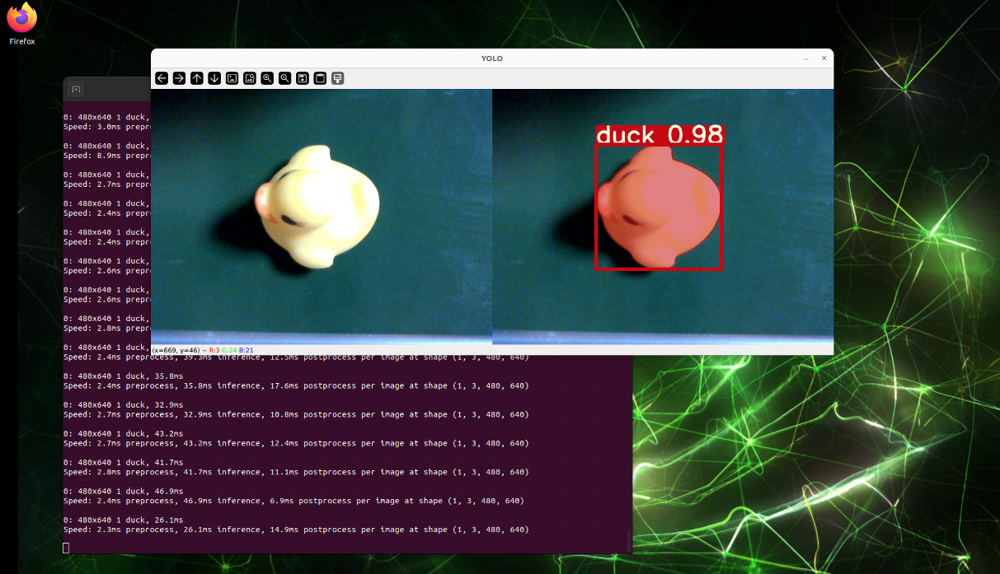
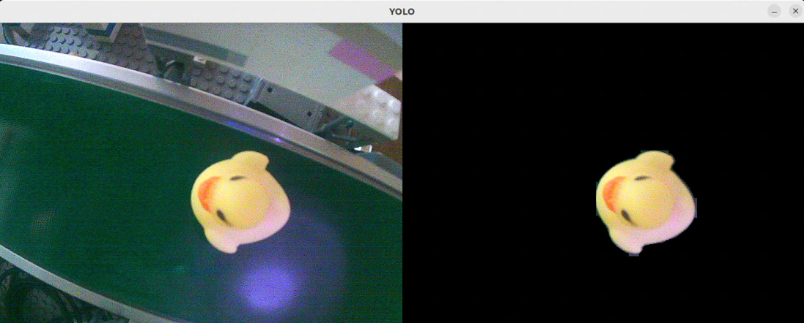
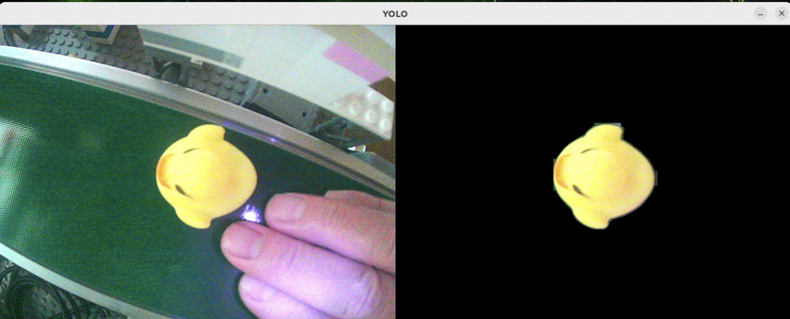
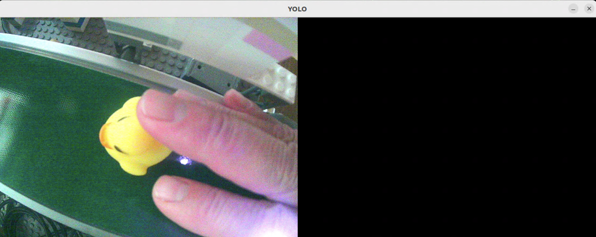
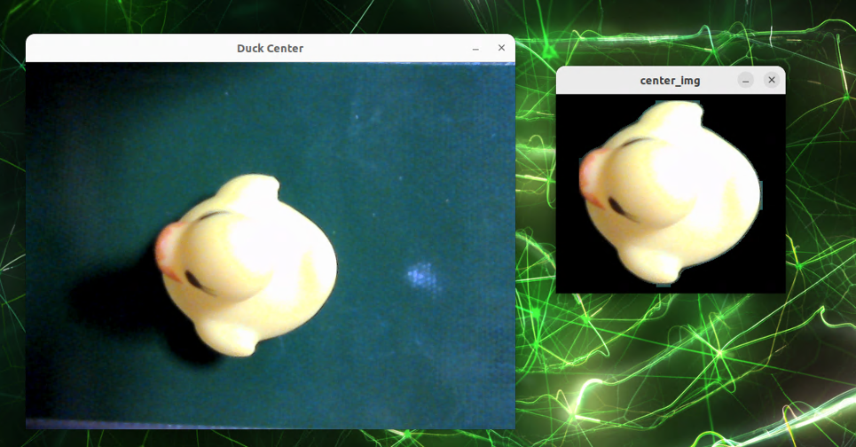
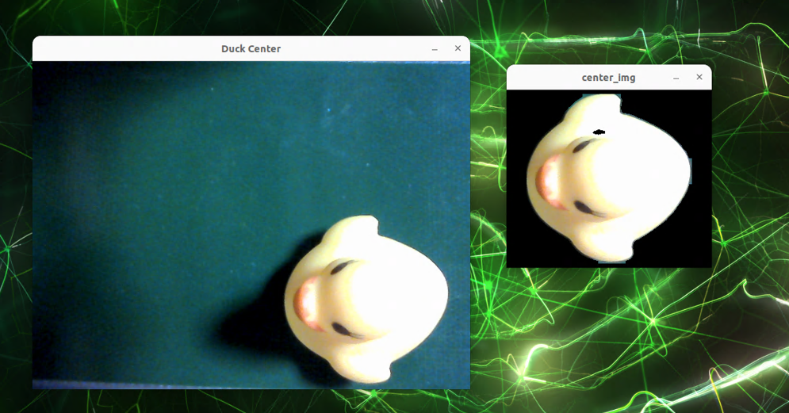
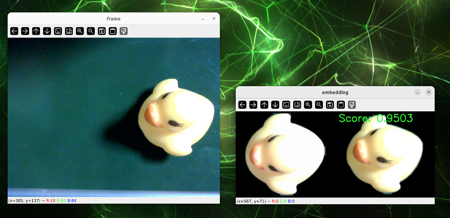
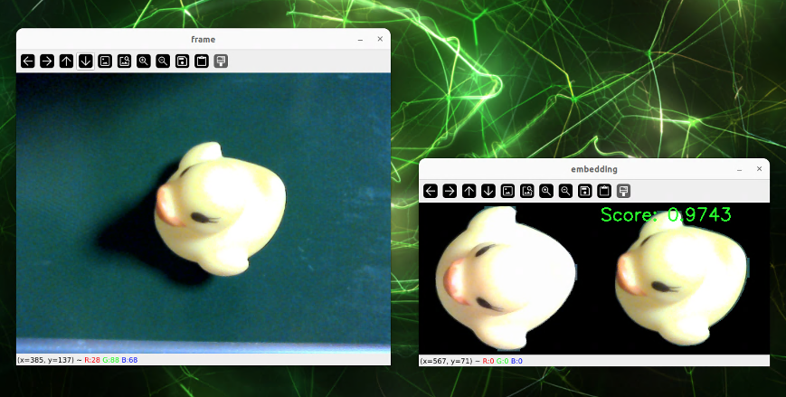
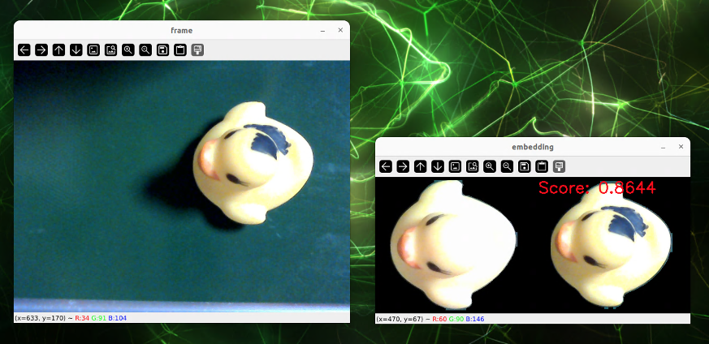
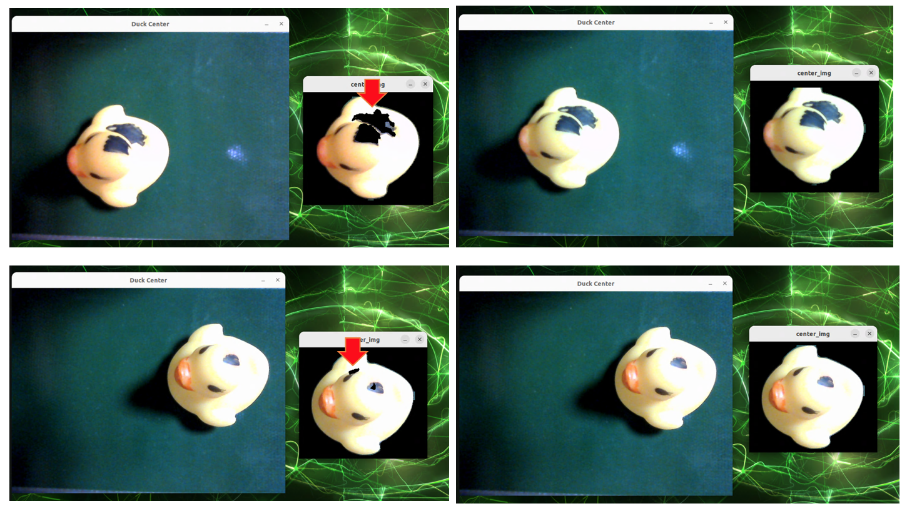

## アプリの動作確認

### (1) 物体検出（Segmentation Model）

* カメラの下にアヒルを配置
* Docker内でcheck_inference.pyを実行
* セグメンテーションできることを確認する

```
$ ./docker-run.sh
# python3 check_inference.py
```




### (2) 物体検出（Segmentation Model） マスク処理

* カメラの下にアヒルを配置
* Docker内でcheck_mask.pyを実行
* アヒルが一定の精度で検出された時のみマスク処理されることを確認する

```
$ ./docker-run.sh
# python3 check_mask.py
```





### (3) 画像処理による中央移動

* カメラの下にアヒルを配置
* Docker内でcheck_center.pyを実行
* アヒルが検出された部分画像が取得できる

```
$ ./docker-run.sh
# python3 check_center.py
```




### (3) embeddingモデルによる判定

* カメラの下にアヒルを配置
* Docker内でcheck_embedding.pyを実行
* base_imageとの距離（相違）が表示される
* 数値が小さいほど、類似性が低い（問題あり）  

```
$ ./docker-run.sh
# python3 check_embedding.py
```







