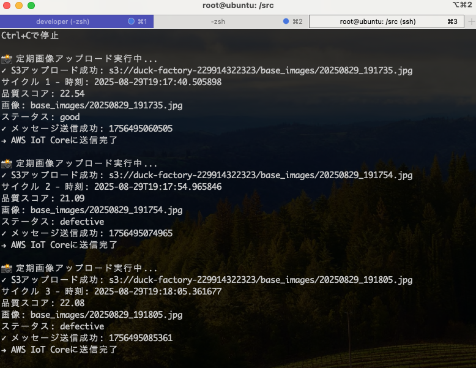
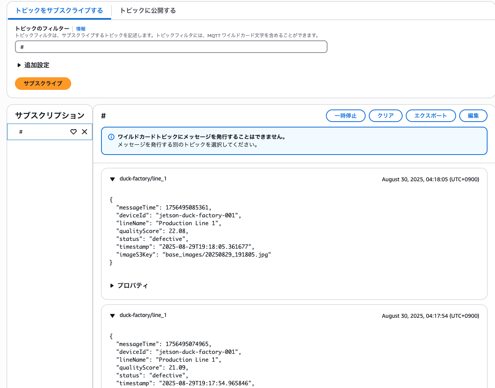
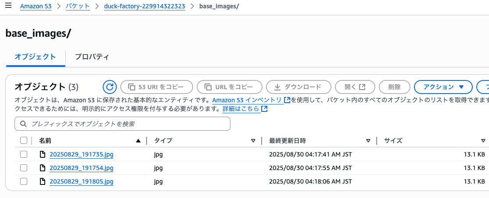

## IoTの動作確認

### (1) 定期的な画像とトピックの送信

* 10秒間隔で、画像及び、トピックの送信を行います
* 画像は、base_image.jpg
* データ内容はランダム

```
$ ./docker-run.sh
# python3 check_iot.py
```

```
duck-factory-229914322323/base_images/yyyymmdd_hhmmdd.jpg
```

```
duck-factory/line_1
August 30, 2025, 04:18:05 (UTC+0900)
{
  "messageTime": 1756495085361,
  "deviceId": "jetson-duck-factory-001",
  "lineName": "Production Line 1",
  "qualityScore": 22.08,
  "status": "defective",
  "timestamp": "2025-08-29T19:18:05.361677",
  "imageS3Key": "base_images/20250829_191805.jpg"
}
```







