## デバイスの動作確認

### (1) Webカメラ

* カメラの下にアヒルを配置
* Docker内でcheck_webcam.pyを実行
* デスクトップにカメラの画像が表示されることを確認する
* カメラは、マニュアルフォーカスなので、この時点でアヒルがぼやけてたらピントを合わせてください

```
$ ./docker-run.sh
# python3 check_webcam.py
```

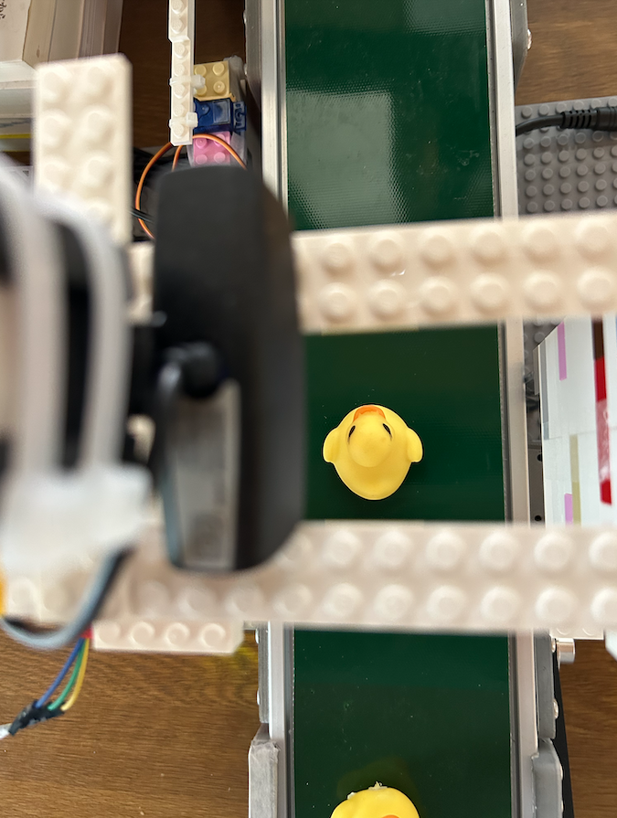
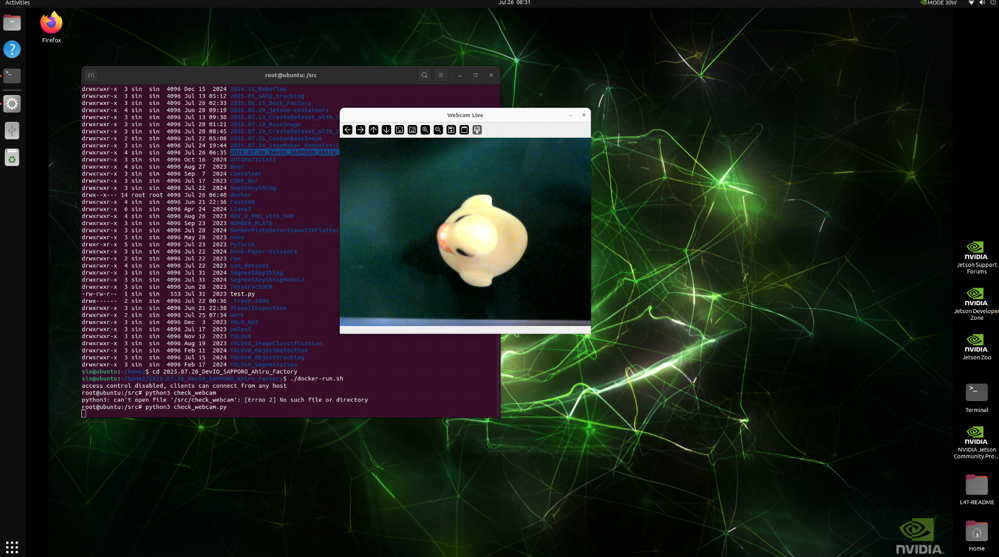


* 参考：カメラの諸元確認
```
# v4l2-ctl -d /dev/video0 --list-formats-ext
```

### (2) センサー


* センサーとJetsonを接続する
```
* Sensor VCC - Jetson 4番ピン 5V
* Sensor GND - Jetson 6番ピン　GND
* Sensor OUT - Jetson 16番ピン　GPIO 08
```
* Docker内でcheck_sensor.pyを実行
* アヒルが居ない時:1 アヒル通過時:0 となることを確認
* センサーの感度は、可変抵抗で設定できます

```
$ ./docker-run.sh
# python3 check_sensor.py
sensor:1
sensor:1
sensor:1
sensor:1
sensor:1
sensor:1
sensor:1
sensor:1
sensor:0
sensor:0
sensor:0
sensor:1
```
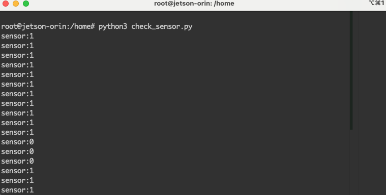

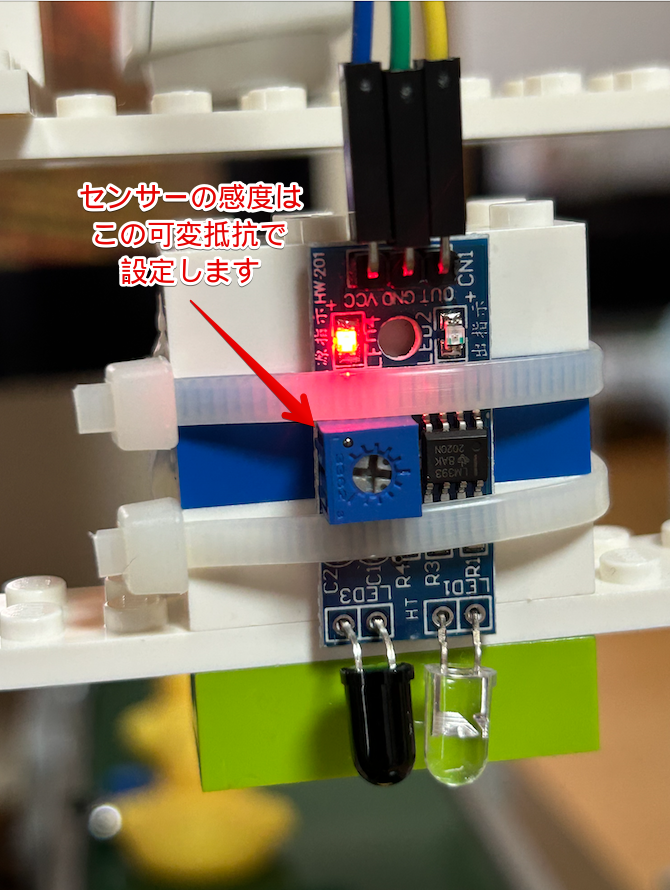
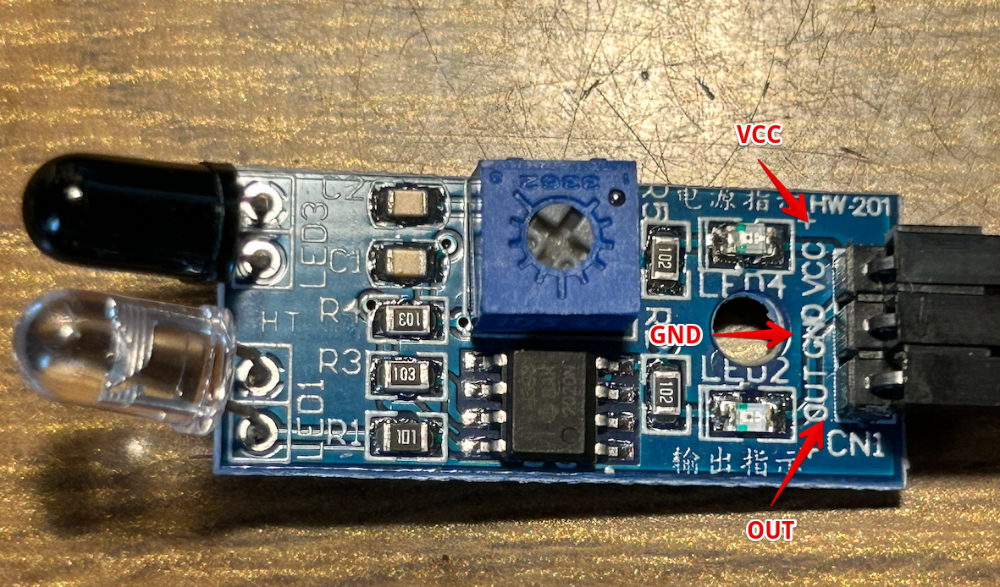
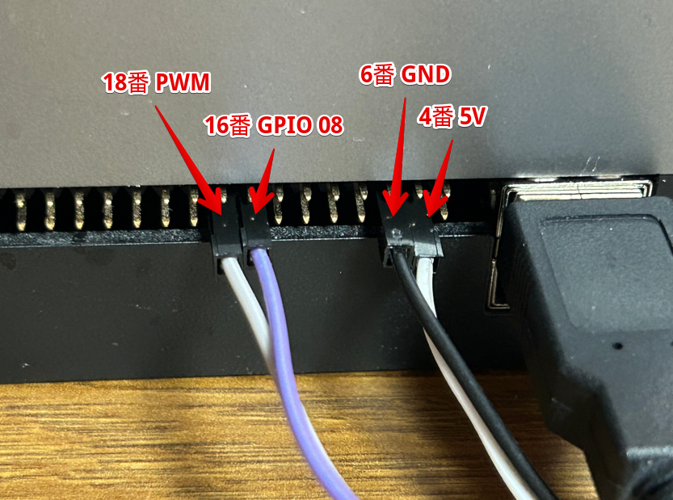
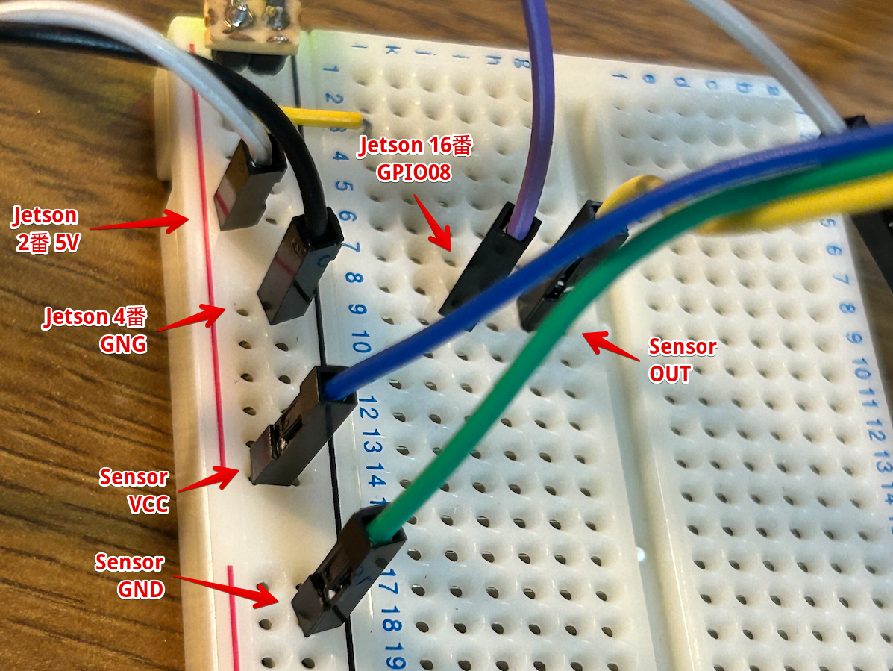


### (3) サーボモータ

* pwm5を有効化する

```
$ sudo /opt/nvidia/jetson-io/jetson-io.py
　
> Configure Jetson 40pin Header
> Configure header pins manually
> [*] pwm5  (18) ここにEnterでチェックを入れる
> Back
> Save pin changes
> Save and reboot to reconfigure pins
> Enter でリブートされる
```

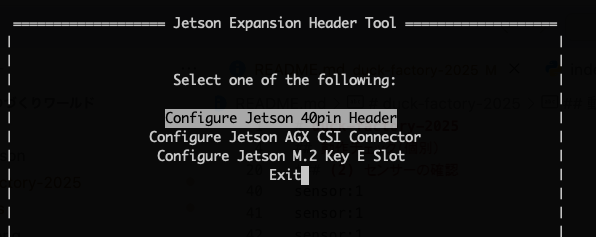
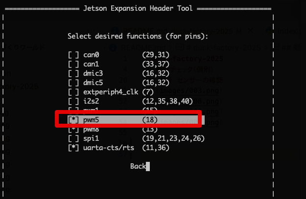

参考：
https://docs.nvidia.com/jetson/archives/r34.1/DeveloperGuide/text/HR/ConfiguringTheJetsonExpansionHeaders.html

```
ls -la /boot/*.dtbo
```

* サーボモータをとJetsonを接続する
```
* Servo 5V（赤） - Jetson 2番ピン 5V
* Servo GND（茶） - Jetson 4番ピン　GND
* Servo PWM（オレンジ） - Jetson 18番ピンPWM
```

* Docker内でcheck_servo.pyを実行
* check_servo.pyを起動すると、5秒に1回、モータが動作する

* 参考：動作確認している様子の動画　**images/check_servo.mp4**

```
$ ./docker-run.sh
# python3 check_servo.py
start
check
check
check
check
check
```

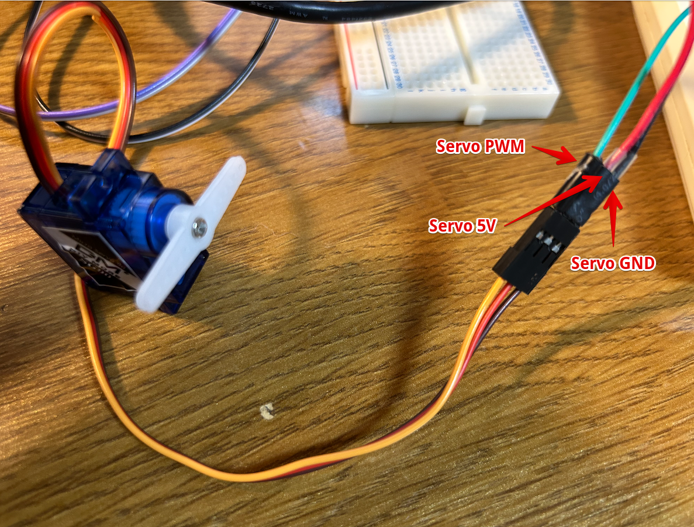
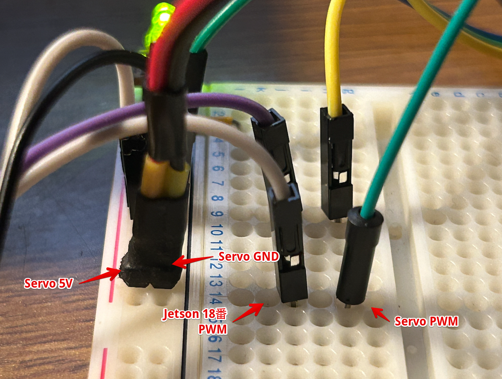
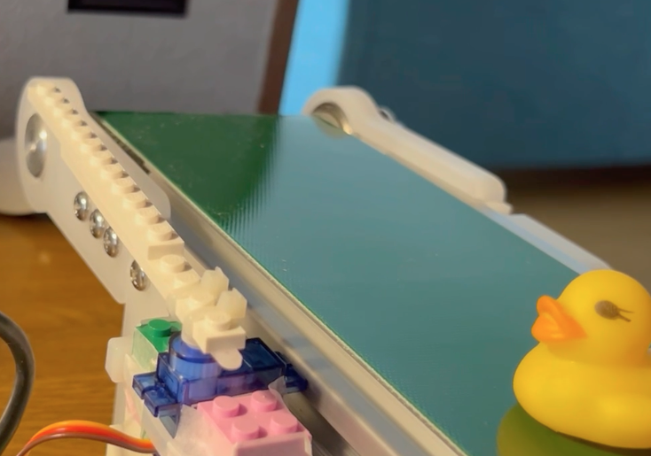
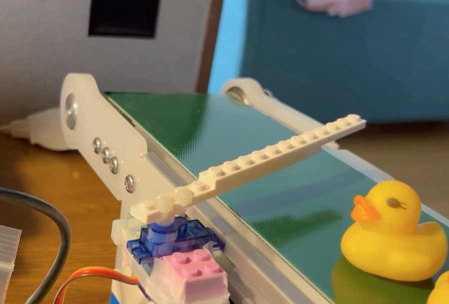


### (4) 参考

*  GPIO
https://developer.nvidia.com/embedded/learn/jetson-agx-orin-devkit-user-guide/developer_kit_layout.html


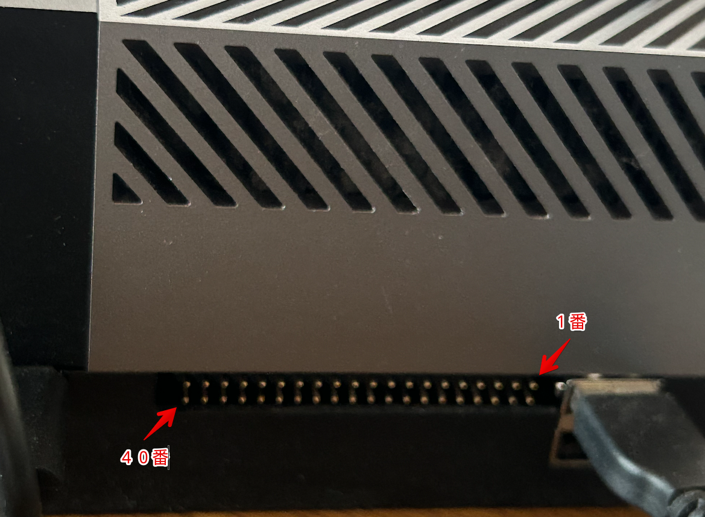
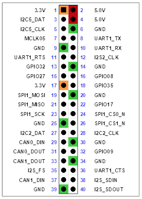
